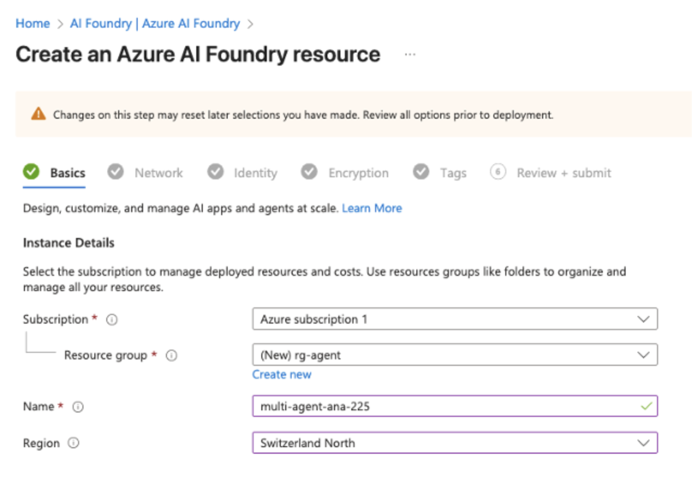
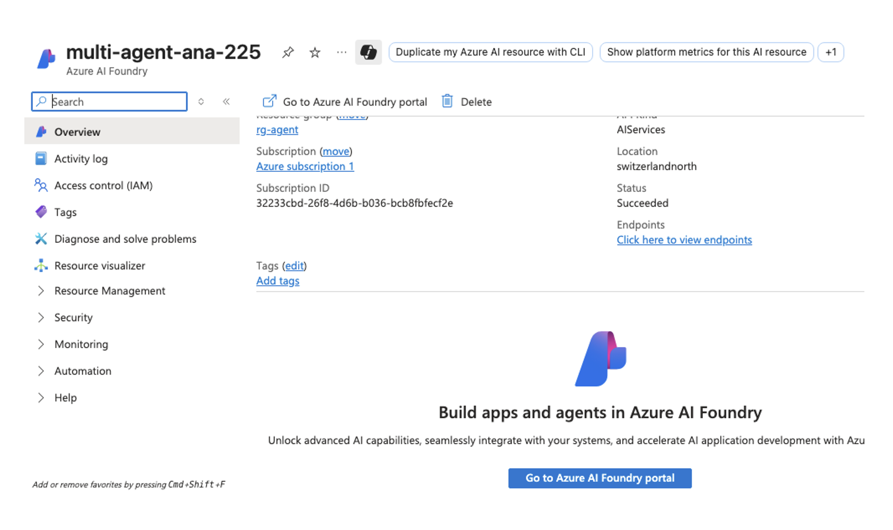
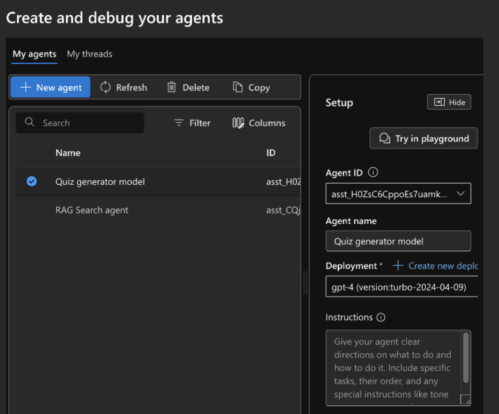
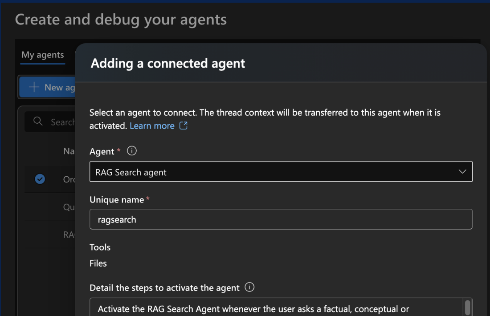
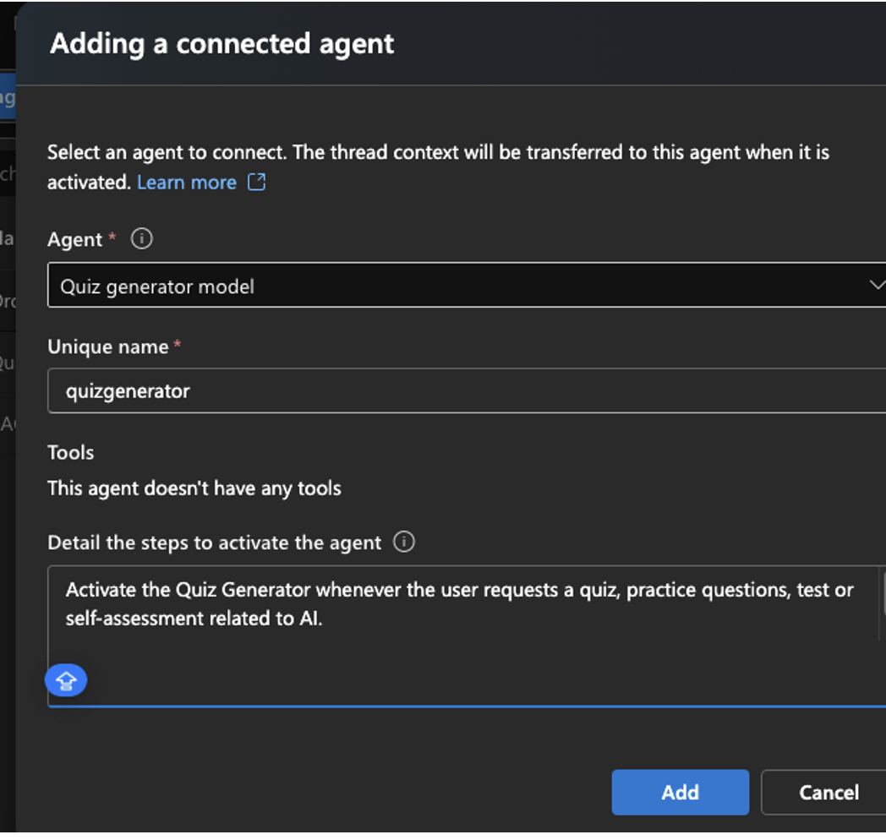
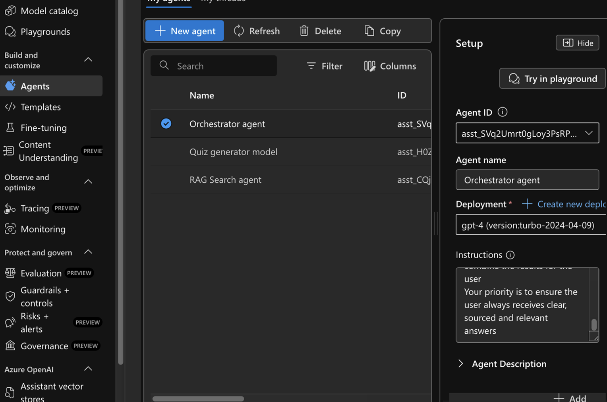
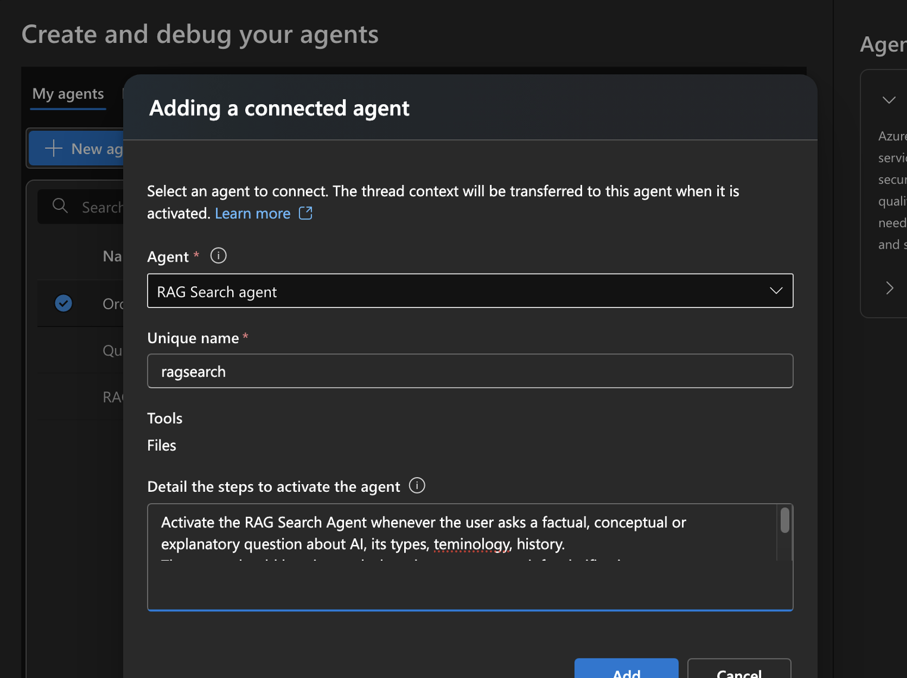
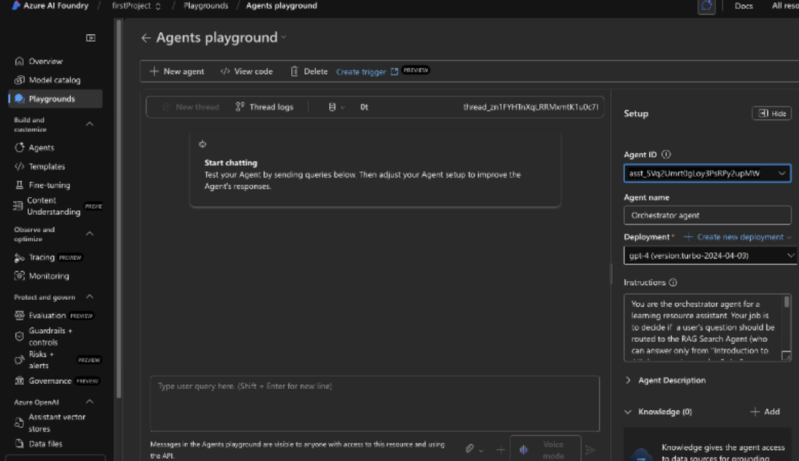
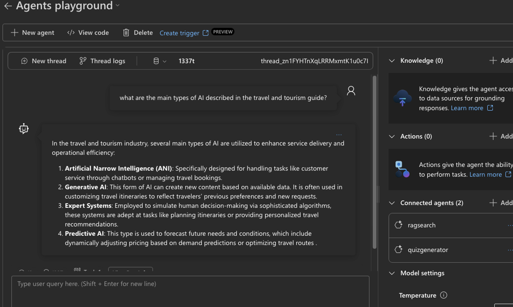
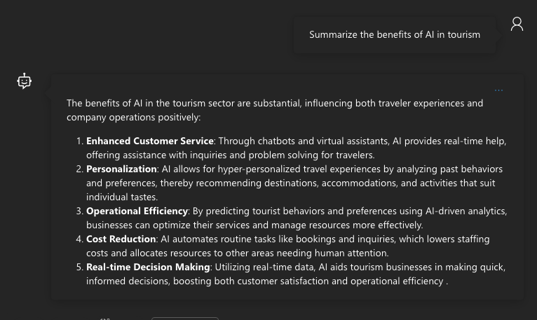

# Description

I will create a ulti-agetn app with connected agents using Azure AI Agent Service

# Steps

Go to AI Foundry and create a new resource:

Rest as default

Open resource and go to Azure AI Foundry portal

Deploy base model. We’ll choose gpt-4.0

We upload a file about AI instructions.

Give instructions to the RAG agent:

Now we’ll build the quiz generator agent:

Now the orchestrator agent:

Click Connected agents

Same for the Quiz Generator:

We have 2 agents connected to the orchestrator

Go to playground and select the Orchestrator agent:

# Results

And we ask a question:

And we ask another question:

And the results are pretty good!
